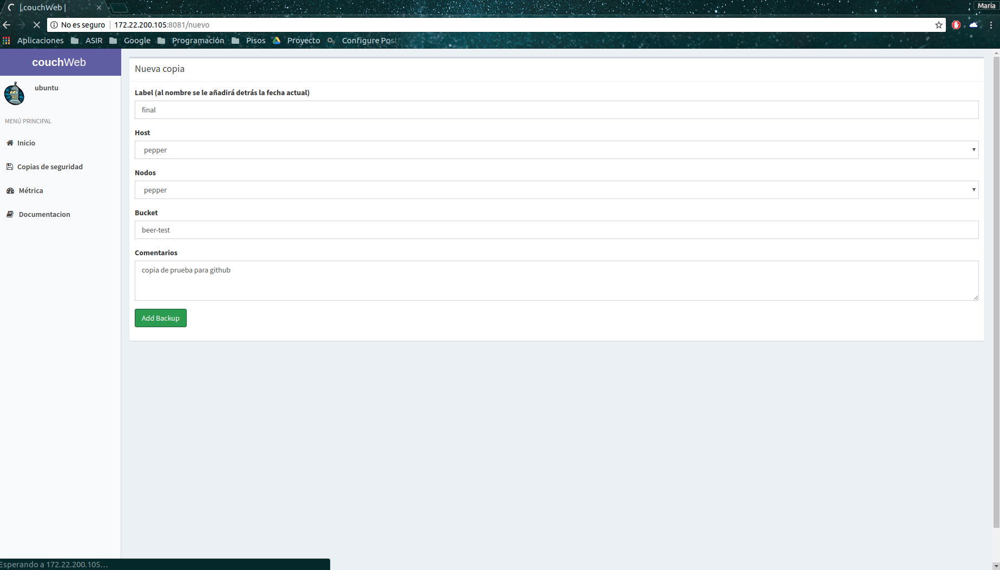

# couchweb
Aplicación web para la gestión de las copias de seguridad y la monitorización del entorno creado para CouchBase.

Está escrita en python usando el framework ligero Bottle y usando un entorno virtual.

Obviando los directorios y ficheros dedicados a estilos propios de la plantilla, la estructura de la aplicación es:

	couchbase
	├── LICENSE
	├── README.md
	├── requirements.txt
	└── web
		├── app.wsgi
		├── footer.tpl
		├── header.tpl
		├── index.tpl
		├── main.py
		└── static
			├── pages
			│	├── backups
			│	│	├── backups.tpl
			│	│	├── nuevo2.tpl
			│	│	├── nuevo.tpl
			│	│	├── restaurar2.tpl
			│	│	├── restaurar3.tpl
			│	│	└── restaurar.tpl
			│	├── docs.tpl
			│	└── monitorización
			│		├── jarvis.tpl
			│		└── monitorizacion.tpl
			└── bender.png

- *requirements.txt*: contiene las librerias a instalar con pip para el correcto funcionamiento de la aplicación.
	
		pip install -r requirements.txt

- *main.py*: contiene la aplicación en sí.
- *header.tpl*: contiene todo lo común en todas las plantillas como el título de la web y la columna lateral en cuanto a encabezado.
- *footer.tpl*: contiene todo lo común en todas las plantillas en cuanto a pie de página.
- *index.tpl*: página principal. Contiene un breve resumen de los servidores activos, inactivos y totales.
- *backups.tpl*: página principal de las copias de seguridad. Nos muestra las últimas 10 copias realizadas y nos da opciones de crear o restaurar.
- *nuevo.tpl*: contiene el formulario para poder realizar una nueva copia.
- *nuevo2.tpl*: recibe los datos del fomulario y ejecuta el comando.
- *restaurar.tpl*: nos pide el host a restaurar, para mostrar en el siguiente formulario las copias disponibles para restaurar.
- *restaurar2.tpl*: contiene el formulario para poder restaurar una copia.
- *restaurar3.tpl*: recibe los datos de los formularios para poder ejecutar el comando.
- *docs.tpl*: muestra los luegares principales que se han usado para instalaciones y documentación en general.
- *jarvis.tpl*: muestra un breve resumen del estado de los discos y la RAM y nos da la opción de ver su zabbix.
- *monitorizacion.tpl*: página principal de la parte de monitorización en la que se muestra un resumen de los hosts existentes, dando el estado u un resumen de cada host. Redirige todos los host al zabbix correspondiente y al resumen de jarvis.

## Paqueteria
Para poder utilizar la web con el entorno virtual son necesarios los siquientes paquetes:
	
	apt install python-pip fping gcc python-virtualenv python-dev build-essential git apache2 mysql-server-5.6 php 

## MySQL
Para esta aplicacion hay que crear una base de datos llamada backups con dos tablas: backups y restore

	create database backups;
	
	create table backups
	(
		label varchar(50),
		host varchar(7),
		nodos varchar(10),
		bucket varchar(25),
		fecha varchar(40),
		comentarios varchar(100)
	);

	create table restore
	(
		label varchar(50),
		host varchar(7),
		directorio varchar(50),
		origen varchar(25),
		destino varchar(25),
		comentarios varchar(100)
	);

# Ejecucion de la aplicación
Está montada con un entorno virtual por limpieza del equipo y para tenerlo todo  bien localizado. Al entorno lo he llamado v-couchweb y para activarlo:
	
	ubuntu@jarvis:~$ source v-couchweb/bin/activate
	(v-couchweb) ubuntu@jarvis:~$ 

Las claves de acceso a las bases de datos las he creado como variables en el sistema y el programa las busca por lo que hay que exportarlas:
	
		(v-couchweb) ubuntu@jarvis:/var/www/html/couchweb/web$ export CBPASS='pass'
		(v-couchweb) ubuntu@jarvis:/var/www/html/couchweb/web$ export MYSQLPASS='pass'

Siendo 'pass' la clave que hayamos puesto en las configuraciones

Los archivos de la aplicación está en /var/www/html/couchweb/web, para facilitar la mejora de la integración con apache. Una vez en ese directorio, lanzamos la aplicación:
	
		(v-couchweb) ubuntu@jarvis:~$ cd /var/www/html/couchweb/web/
		(v-couchweb) ubuntu@jarvis:/var/www/html/couchweb/web$ python main.py 
		Bottle v0.12.13 server starting up (using WSGIRefServer())...
		Listening on http://0.0.0.0:8081/
		Hit Ctrl-C to quit.

# Capturas y ejemplos
## Página de inicio
Muestra el número de hosts totales, activos e inactivos.

## Copias de seguridad
Nos muestra las 10 últimas copias realizadas.

Al crear una nueva copia, nos muestra este formulario con los datos necesarios para generar el comando y ejecutarlo en el servidor correspondiente.

Si la copia se ha realiado correctamente, aparece la primera en la lista.

Para restaurar, primero necesitamos saber qué host es el que tiene los ficheros.

Una vez tiene el host, con este formulario genera el comando y lo ejecuta.

## Métrica
En esta página nos muestra los host que hay y cierta información útil como el estado.
Al hacer click en el host nos manda a su correspondiente dashboard de grafana.

## Documentación
Sitios de los que se ha sacado la documentación principal de la aplicación web.
